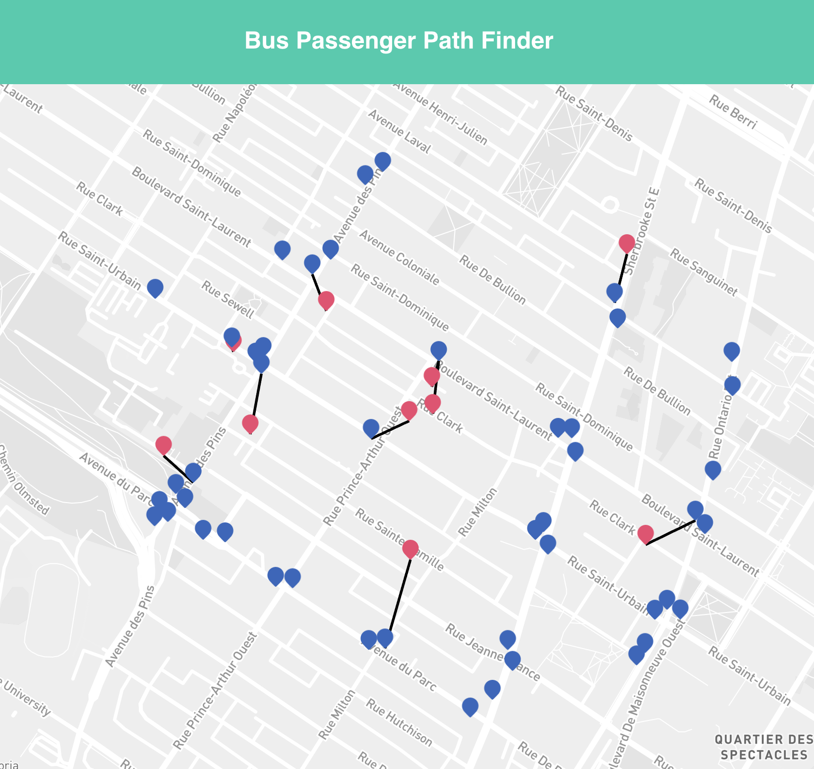

<h1>Bus Stop Finder</h1>

    

<h1>To Run</h1>

### `npm install`

Installs all the dependencies for the project

### `npm start`

Runs the app in the development mode. 
Open [http://localhost:3000](http://localhost:3000) to view it in the browser.

The page will reload if you make edits. 
You will also see any lint errors in the console.